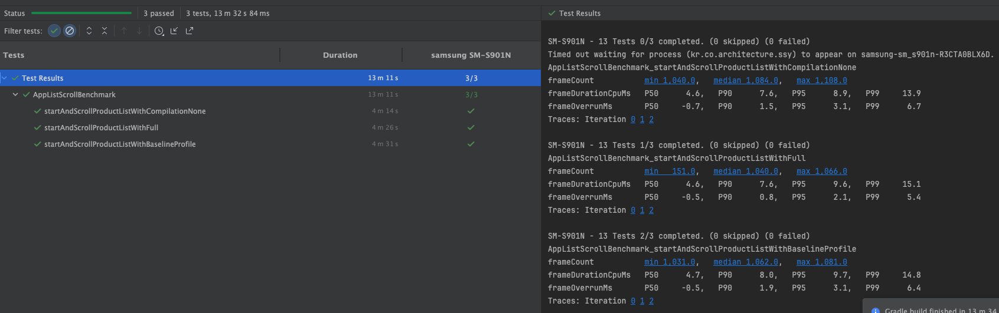

## 목차
1. 빌드 환경
2. 아키텍처 구조도
3. 테스트 케이스
4. BaselineProfile 성능 측정 결과

## 1. 빌드 환경
해다 과제가 실행된 빌드 환경을 의미합니다. 만약 과제 빌드에 문제가 있을 시, 아래 빌드 환경을 참고하시면 좋습니다.

## 2. 아키텍처 구조도
해당 과제가 실행된 아키텍처 구조입니다. **Android공식 아키텍처**를 사용했으며, UI Layer, Domain Layer, Data Layer에 따라 앱을 구조화 하였습니다.
또한 각 Layer에는 해당 Model들이 존재합니다. (eg., *.DomainResponse, *.DtoResponse...)

## 3. 테스트 케이스
해당 과제가 수행된 테스트 케이스로써, UI 테스트와 비즈니스 로직 단위 테스트를 진행하였습니다.

### UI 테스트

| 테스트 영역             | 테스트 클래스            | 테스트 메서드                                                                                                                                                                                                                                                                                              | 통과 |
| ------------------ | ------------------ | ---------------------------------------------------------------------------------------------------------------------------------------------------------------------------------------------------------------------------------------------------------------------------------------------------- | -- |
| **SearchScreen**   | `SearchScreenTest` | - 검색어를\_입력하면\_텍스트필드에\_표시되고\_콜백으로\_전달된다 - 키보드검색액션을\_누르면\_onSearch가\_현재검색어로\_호출된다 - 지우기아이콘을\_누르면\_검색어가\_비워지고\_콜백이\_빈문자열로\_온다 - 정렬칩에서\_항목을\_선택하면\_onChangeSort가\_호출된다 - 책카드를\_탭하면\_해당\_isbn을\_콜백으로\_받는다 - 북마크를\_탭하면\_isbn과\_북마크\_상태를\_콜백으로\_받는다 - 리스트\_끝까지\_스크롤하면\_페이징을\_위한\_콜백을\_받는다 | ✅  |
| **BookmarkScreen** | 미작성                | —                                                                                                                                                                                                                                                                                                    | —  |
| **DetailScreen**   | 미작성                | —                                                                                                                                                                                                                                                                                                    | —  |

### 단위 테스트(ViewModel)
| 테스트 영역                | 테스트 클래스               | 테스트 메서드                                                                                                                                                                                                                                    | 통과 |
| --------------------- | --------------------- | ------------------------------------------------------------------------------------------------------------------------------------------------------------------------------------------------------------------------------------------ | -- |
| **SearchViewModel**   | `SearchViewModelTest` | - 검색\_요청하면\_리스트가\_로딩되고\_UI가\_업데이트된다 - 스크롤을\_요청하면\_페이징을\_위한\_사이드이펙트가\_발행된다 - 아이템\_탭하면\_상세로\_네비게이션된다 - 북마크\_클릭하면\_ToggleBookmarkUseCase가\_호출된다 - 북마크\_관찰\_데이터가\_도착하면\_리스트의\_표시상태가\_동기화된다 - 정렬칩을\_변경하면\_검색결과를\_지우고\_처음부터\_로딩한다 | ✅  |
| **BookmarkViewModel** | 미작성                   | —                                                                                                                                                                                                                                          | —  |
| **DetailViewModel**   | 미작성                   | —                                                                                                                                                                                                                                          | —  |

### 단위 테스트(UseCase)
| 테스트 영역                            | 테스트 클래스                             | 테스트 메서드                                                                                                                                                                                                                                                                                                                                                                            | 통과 |
| --------------------------------- | ----------------------------------- | ---------------------------------------------------------------------------------------------------------------------------------------------------------------------------------------------------------------------------------------------------------------------------------------------------------------------------------------------------------------------------------- | -- |
| **ObserveBookmarkedBooksUseCase** | `ObserveBookmarkedBooksUseCaseTest` | - 제목이\_포함된\_검색어를\_필터링한다 - 출판사가\_포함된\_검색어를\_필터링한다 - 저자가\_포함된\_검색어를\_필터링한다 - 제목\_출판사\_저자가\_포함된\_검색어를\_필터링한다 - 가격필터\_10000원\_미만\_적용하면\_10000원\_미만\_책만\_필터링된다 - 가격필터\_10000원\_이상\_적용하면\_10000원\_이상\_책만\_필터링된다 - 정렬방향\_내림차순이\_적용되면\_제목기준\_내림차순으로\_받는다 - 정렬방향\_오름차순이\_적용되면\_제목기준\_오름차순으로\_받는다 - 검색어\_A\_10000원\_이상\_오름차순\_동시필터링 - 검색어\_A\_금액\_미만\_내림차순\_동시필터링 | ✅  |

### 단위 테스트(Repository)
| 테스트 영역                 | 테스트 클래스                          | 테스트 메서드                                                                                                                                                                                                                                                | 통과 |
| ---------------------- |----------------------------------| ------------------------------------------------------------------------------------------------------------------------------------------------------------------------------------------------------------------------------------------------------ | -- |
| **BookRepositoryImpl** | `BookRepositoryImplTest` | - toggleBookmark\_호출시\_observeBookmarkedBooks\_스트림이\_변경을\_방출한다 - 검색API\_호출한\_상황에서\_toggleBookmark\_SAVE\_이후엔\_searchBook을\_호출하면\_북마크\_true를\_반영해\_반환한다 - 캐싱된Book\_조회한\_상황에서\_toggleBookmark\_SAVE\_이후엔\_searchBook을\_호출하면\_북마크\_true를\_반영해\_반환한다 | ✅  |

## 4. BaselineProfile 성능 측정 결과
홈 화면의 성능 개선을 위해 BaselineProfile 생성 후, 벤치마크를 측정한 결과입니다.

