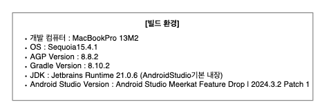
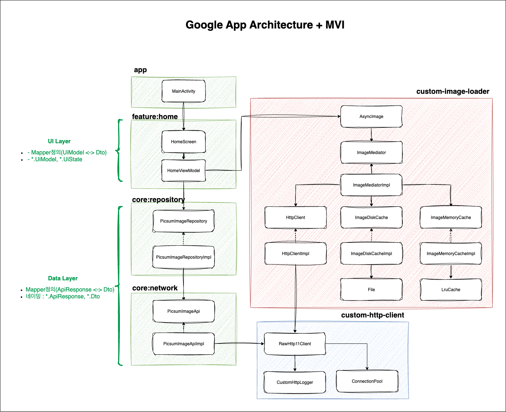
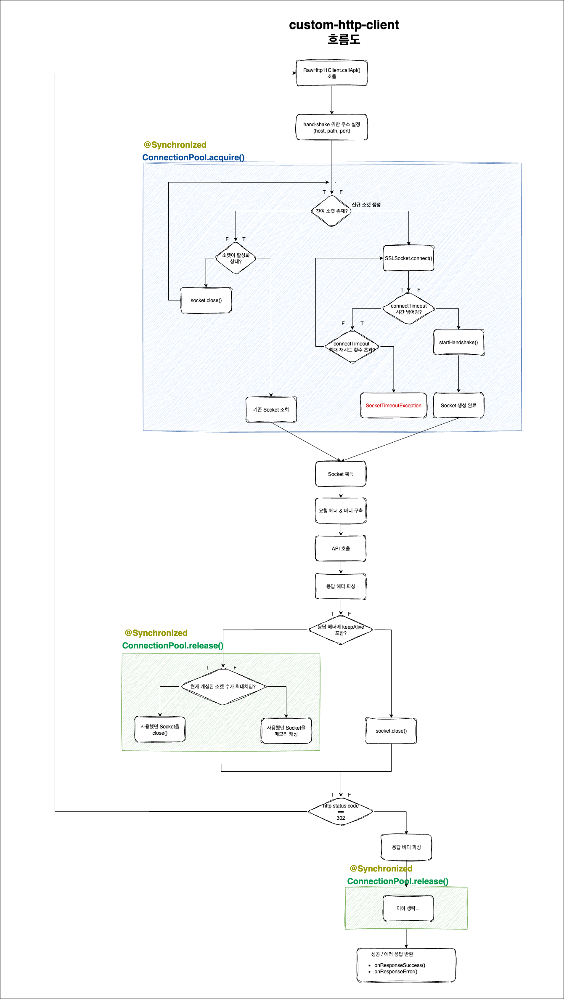
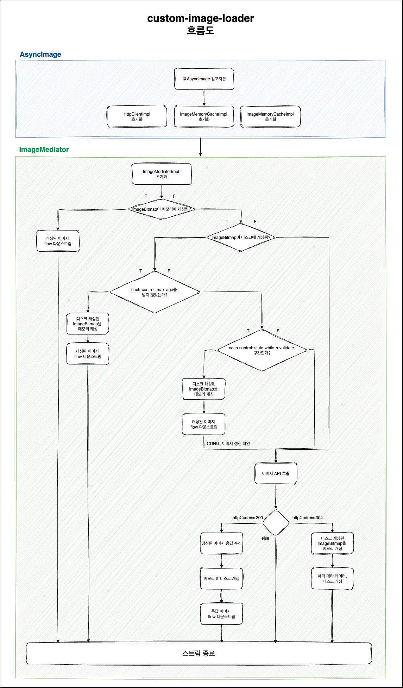
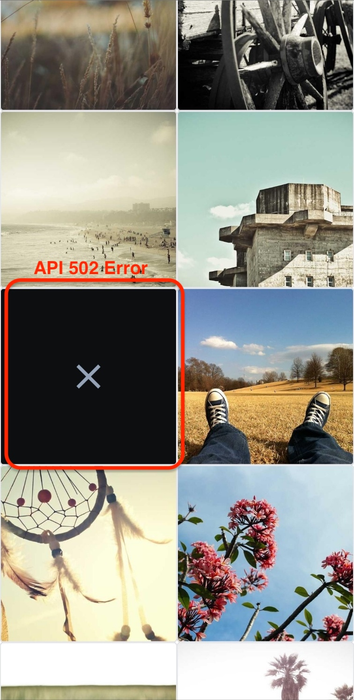
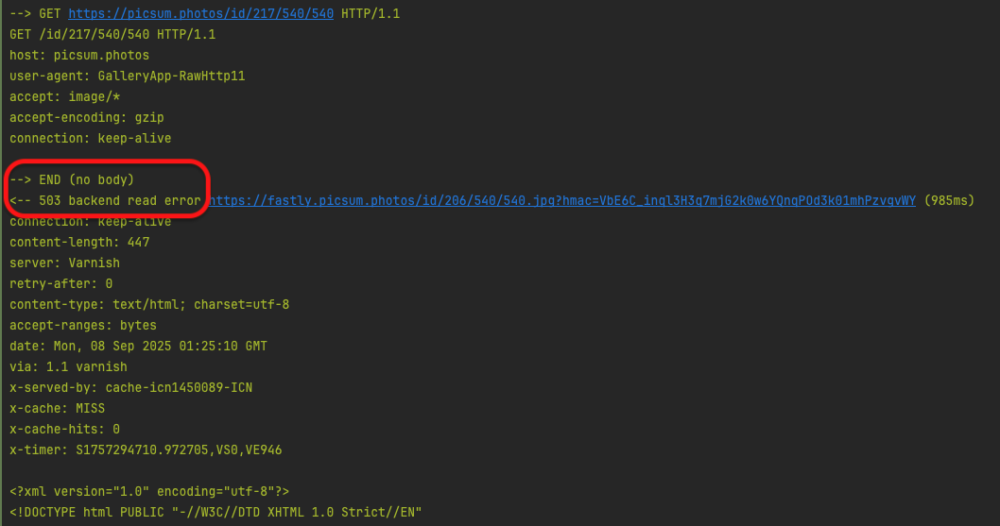

## 목차
> 1. 빌드 환경
> 2. 전체 아키텍처 구조도
> 3. custom-http-client 흐름도
> 4. custom-image-loader 흐름도
> 5. 그 외, API 오류
> 6. 앱 시연 영상

## 1. 빌드 환경
해다 과제가 실행된 빌드 환경을 의미합니다. 만약 과제 빌드에 문제가 있을 시, 아래 빌드 환경을 참고하시면 좋습니다.


## 2. 아키텍처 구조도


해당 과제가 실행된 아키텍처 구조입니다. 

- **[App앱]** : `Google Guide to App Architecture`에 `MVI`를 결합해 사용했습니다. 구조는 `UI` / `Domain` / `Data` 레이어로 나뉘며, 각 레이어에 대응하는 `Model`과 `Mapper`를 둡니다(예: `*.DomainResponse`, 매퍼 함수 `mapperToDto()` / `mapperToUiModel()` 등).

- **[custom-http-client]** : HTTP/1.1 스펙을 직접 구현한 통신 모듈입니다. HTTP/1.1은 멀티플렉싱이 없으므로, 내부 ConnectionPool로 Socket을 재사용합니다.
  - 호스트당 최대 6개 유휴 연결을 보관하고, keep-alive인 경우 15초 동안 재사용합니다.
  - 302 Redirect(Location 헤더) 처리로 CDN(예: Fastly)로의 전환을 지원합니다.
  - 그 외 HTTP/1.1 기본 동작(chunked 전송 해제, Content-Length 고정 읽기, gzip 인코딩 해제, Connection: keep-alive 처리 등)을 구현했습니다.

- **[custom-image-loader]** : `custom-http-client`를 사용해 이미지를 로딩하는 모듈입니다. `[GET] /v2/list call` -> `download_url call`시, 302 응답을 받습니다. 그 후, CDN(Fastly)서버로 리다이렉트합니다.
  - 메모리 캐시: `ImageMemoryCacheImpl`(LRU 기반)
  - 디스크 캐시: `ImageDiskCacheImpl`(내부 File저장, Cache-Control/ETag/Last-Modified 해석, SWR 갱신)
  - 호출 측은 `AsyncImage`에서 `enableMemoryCache`, `enableDiskCache` 플래그로 캐싱 전략을 선택할 수 있습니다.

```kotlin
// HomeScreen.kt 참고
AsyncImage(
  url = item.image,
  enableMemoryCache = true,
  enableDiskCache = true,
  loadingPlaceholderContent = {},
  errorPlaceholderContent = {}
) 
```


## 3. custom-http-client


## 4. custom-image-loader


## 5. 그 외, API 오류
- 현재 앱은 기기의 높이/너비를 측정 후, 기기의 해상도 pixel에 맞게 이미지의 높이/너비를 요청하고 있습니다. 현, 테스트 기기 기준 `540/540`으로
요청했으며 그 결과, 간헐적으로 서버로부터 503 에러를 받습니다. (브라우저통한 호출도 동일)
- 아래 `X`자로 표시 된 이미지는 503 에러의 이미지로, `AsyncImage()`의 `errorPlaceholderContent` 파라미터를 통해 표현 가능합니다.
위 2가지 사항 과제 검토 시, 참고 부탁드립니다.




## 6. 앱 시연 영상
### 1). 주요 기능 ([영상 보기](readme-img/main.mp4))
- 첫 로딩 : 이미지를 네트워크로 로딩 후 메모리/디스크 캐싱
  - 앱을 나가지 않고, 위로 스크롤 : 메모리 캐싱된 이미지 로딩
  - 앱을 나간 후 (백스택 삭제) 재접속 : 디스크 캐싱된 이미지 로딩
- 그 외, 무한 스크롤하여 멀티 스레드 환경 내, 이미지 캐싱 / 캐싱 조회 / http통신 동작 확인

### 2). 에러 대응 - NetworkConnection, SocketTimeout, Unknown Error ([영상 보기](readme-img/sub.mp4))
- `NetworkConnection`에러의 경우, cellular, wifi를 모두 off했을 때 발생하는 에러입니다.
- `SocketTimeout`에러의 경우, `connectTimeoutMs = 10`, `maxRetryWhenConnectTimeout = 1`로 설정해 임의로 발생시킨 에러입니다.
- 그 외, 예상치 못한 에러는 `UNKNOWN`에러로 발생시켰습니다.(Eg., `thow Exception()`를 던져 임의로 발생)
